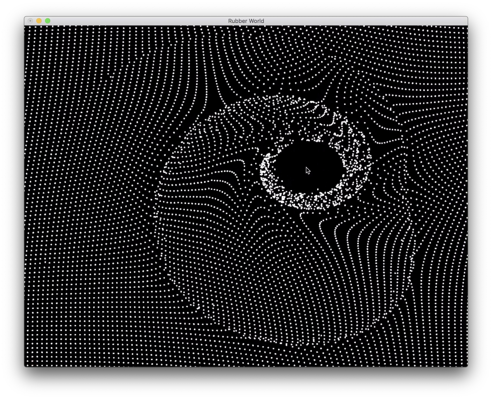
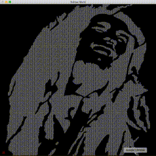

## Experimental OpenCL project

The project is inspired by the nice visualization at Neurodata Lab web site: https://neurodatalab.com/#home

Conceptually the project is a simulation of particles, pinned to their anchor positions with a rubber string. User's mouse pointer creates a force that repels the particles (Neurodata Lab version) or repels and twists the particles in a whirlwind (my version).

Technically the simulation is run in OpenCL, thus is very fast. Visualization is done in OpenGL+GLUT.

### Install, build and run

Currently the project supports MacOS only.

```
# Install XCode
brew install cmake
mkdir build && cd build
cmake ..
make
./try_opencl
```



Video at GDrive:

https://drive.google.com/file/d/1UM5dTZOSpHyH94rkxexdZNVaq-P3cG1w/view?usp=sharing

Encoded with:
```$xslt
ffmpeg -i marley_world.mov -c:v libx264 -crf 30 -preset fast -c:a copy output.mp4
```

Bob Marley-fied version:


